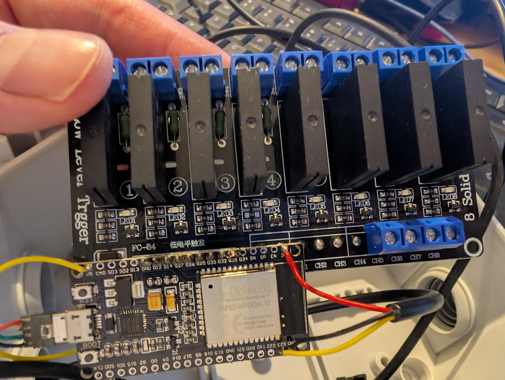
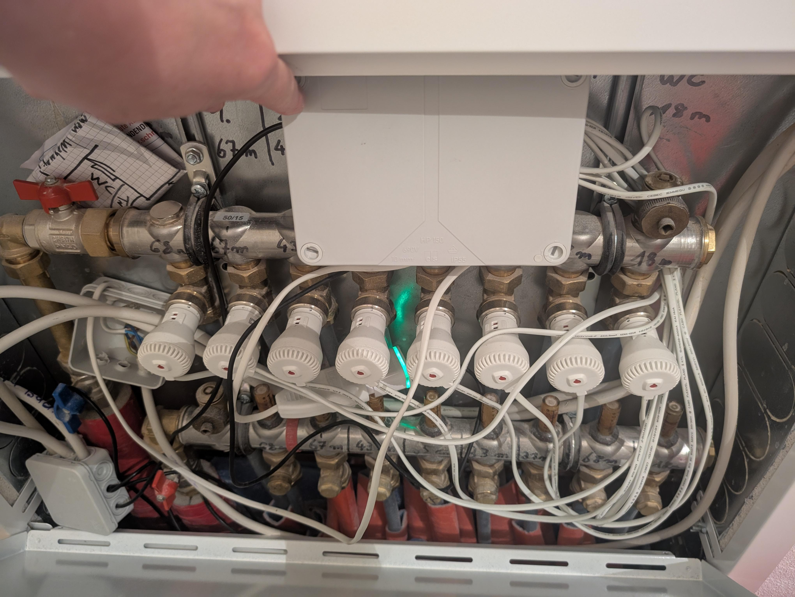
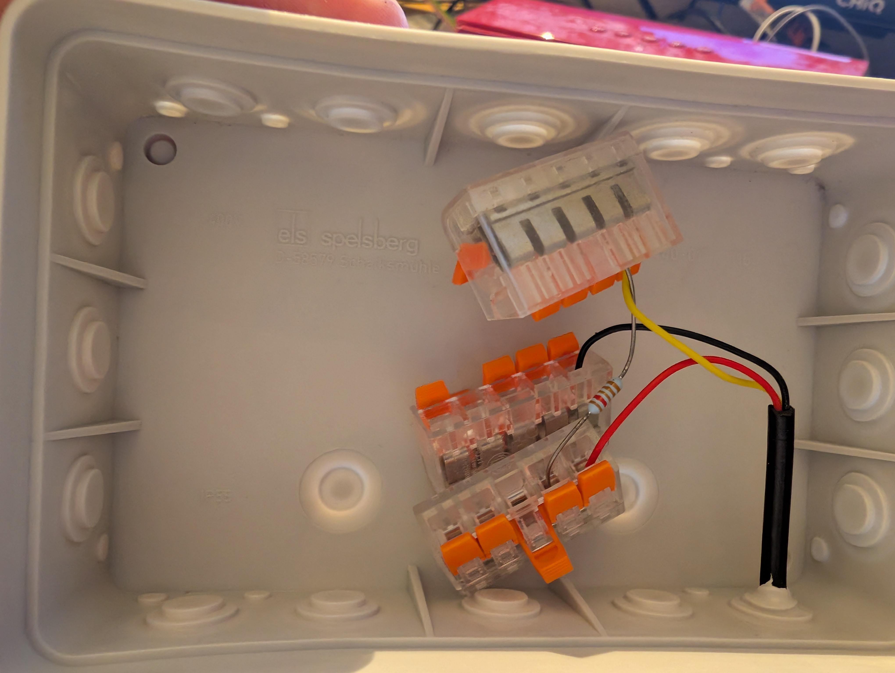
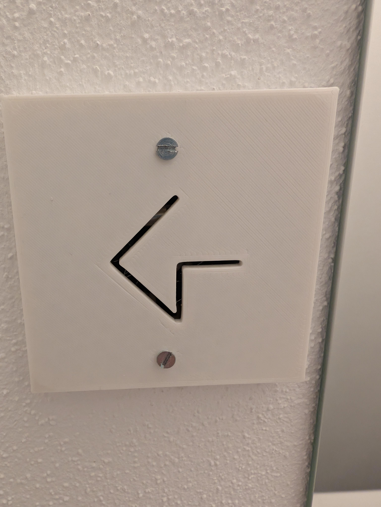
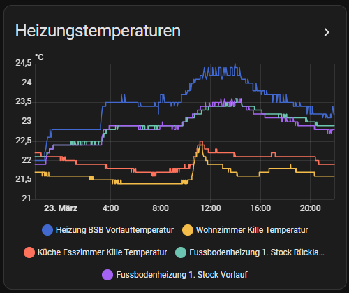
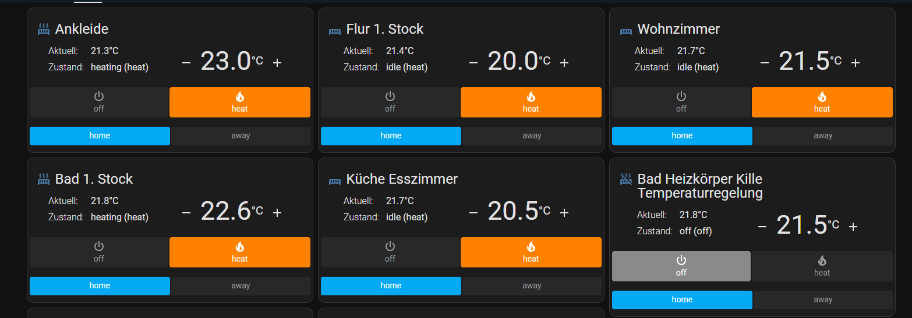

# Underfloor Heating Controller with ESPHome

This project is designed to control an underfloor heating system using an ESP32 running ESPHome. The system connects an ESP32 with a relay board (or, preferably, SSRs) to control the heating valves of a floor heating system. By reusing the pre-existing wiring for Dallas temperature sensors, each room can continuously report its current temperature. The climate device then uses this data to manage heating.

## Features
- Control of underfloor heating via an ESP32 connected to a relay/SSR board.
- Utilization of Dallas temperature sensors with existing wiring.
- Two-point regulation strategy: optimized for the inherent sluggish response of underfloor heating.
- Fully standalone operation on the ESP, ensuring continued performance even if Home Assistant is offline.
- A modular configuration structure optimized for multi-storey buildings, avoiding repetitive configuration across floors.

## Configuration Structure
- **underfloorheating.yaml**: The main configuration file that sets substitutions, ESP settings, sensors, and includes common packages.
- **common/\***: Contains modular YAML files:
   - `sensor_generic.yaml`: Common sensor settings.
   - `network_generic.yaml`: Network settings including WiFi and OTA configuration.
   - `underfloor_heating_termostat.yaml`: Common thermostat settings for the heating control.
   - `underfloor_heating_generic.yaml`: Configuration for the climate devices and switches controlling the heating valves.
- **LICENSE**: Contains the GNU General Public License for the project.

## Setup & Installation
1. Flash the ESP32 with the provided ESPHome configuration.
2. Connect the ESP32 to a relay board or SSRs and interface it with the heating valves.
   - The controller board is housed in the large enclosure shown in the image of the heating manifold.
   
   
3. Install Dallas temperature sensors using the existing wiring in your building.
   - The temperature sensors are all connected in the additional junction box with the Wago connectors.
   
   - To obtain the OneWire sensor addresses, connect one sensor at a time. Then, check the ESPHome logs for the sensor's ID and assign it to the corresponding room in your configuration. Repeat this process for each sensor.
4. Adjust network settings and substitutions in `underfloorheating.yaml` to match your environment.
5. Start the system and enjoy a smart, efficient, and cost-effective heating solution!
   - The USB power supply for the controller board can be seen glowing in the image of the heating manifold.

## Hardware
The hardware required for this project is very cost-effective, with a total cost of under 50€. The main components include:
- ESP32 microcontroller
- Relay board or SSRs
- Dallas temperature sensors
- 5V USB power supply
- some Wagos + installation material

Additionally, a printable cover (`UP-Dose Abdeckung.stl`) is available, which fits standard German wall boxes and includes a holder for the OneWire sensors.

## Visual Representation

### Heating Temperature Graph

### Control Panel

## Notes
If you need any clarifications or further information, please ask.

Happy heating control!
